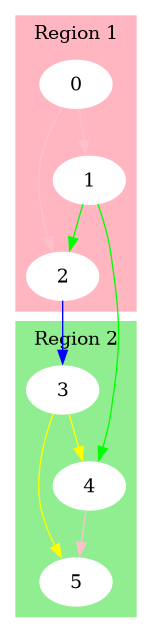

# Dzielenie grafu

Ten program jest drugą częścią projektu na jimp2, ma na celu dzielić graf na k klastrów, każdy klaster ma mieć rozmiar +/- n% w stosunku do innych klastrów. Używa on program stworzony przez inną grupę, który transkrybuje plik .csrrg na plik zawierający macierz pozycji oraz krawędzie grafu.
## Dokumentacja implementacyjna
Czyli jak używać programu.

Do kompilacji programu będzie potrzebne `gcc` oraz `make`

### Pobranie i uruchomienie

1. Sklonuj projekt na swój komputer używając `git`
```bash
git clone https://github.com/julian428/JIMP-Projekt-2025-cz2
```

2. Wejdź do folderu projektu
```bash
cd JIMP-Projekt-2025-cz2
```

3. Skompiluj projekt drugiej grupy
```bash
make sub
```

4. Skompiluj ten projekt
```bash
make
```
5. Uruchom program
```bash
./bin/divide_graph
```

### Szczegóły wywoływania programu.

Program może przyjąć do 5 parametrów.

1. Plik wejściowy `-i` ( czyli plik w formacie csrrg )
2. Plik wyjściowy `-o` ( czyli plik w którym zapisane będą klastry )
3. Ilość klastrów `-c` ( czyli na ile klastrów ma być podzielony graf )
4. Procent marginesu `-p` ( czyli procent maksymalnej różnicy pomiędzy rozmiarem klastrów )
5. `-g` nazwa pliku do którego ma być zapisany plik .dot. Jeżeli takowy nie zostanie podany, plik .dot nie zostanie wygenerowany.
   
   *Plik dot może być użyty do wygenerowania obrazu grafu na przykład za pomocą programu [graphviz](https://graphviz.org/)*
   
   *Przykładowy obraz grafu.*
   

#### Przykładowe wywołanie programu z parametrami

```bash
./bin/divide_graph -i graf.csrrg -o regiony.txt -c 4 -p 20 -g graph.dot
```

Parametry mogą być ustawione w dowolnej kolejności. Nie koniecznie tak jak w powyższym przykładzie.

**UWAGA** Wartość odpowiadająca parametrowi musi znajdywać się zaraz po deklaracji parametru np. `-o test.txt`

Nie może dojść do takiej sytuacji:
```bash
./bin/divide_graph -o -i klastry.txt graf.csrrg
```

W powyższym przypadku program odczyta nazwe pliku wyjściowego jako `-i` a nazwe pliku wejściowego jako `klastry.txt`

### Przykładowe pliki wejścia i wyjścia

Wejście
```graf.csrrg
4
1;0;2;0;2;1
0;1;3;5;6
0;1;2;1;2;4;2;3;3;4;5;4;5
0;3;6;8;11
```

Wyjście
```clusters.txt
nodes:6 edges:8 clusters:3 percentage:10.000000 cluster_size:2
0;0@0.577009;-0.532573 5;0@-0.577846;-0.531974
1;1@0.288783;0.459205 2;1@0.288831;0.072487
3;2@-0.288446;0.072418 4;2@-0.288331;0.460436
0 -> 1
0 -> 2
1 -> 2
1 -> 4
2 -> 3
3 -> 4
3 -> 5
4 -> 5

```

W pliku wyjściowym pierwsza linijka jest linijką informacyjnną zawierającą:
- nodes - ilość wierzchołków
- edges - ilość krawędzi
- clusters - ilość klastrów
- percentage - dozwolona różnica rozmiaru od idealnego rozmiaru klastra
- cluster_size - idealny rozmiar klastra

Następne "clusters" linijek przedstawia klastry gdzie każdy wierzchołek jest oddzielony od innych spacją i jest zapisany w formacie:
`number_wierzchołka;numer_klastra@x;y`

Następnie po linijkach z klastrami jest "edges" linijek z połączeniami w formacie:
`wierzchołek_z -> wierzchołek_do`

#### Wygląd grafu z podanych przykładów powyżej.


## Dokumentacja funkcjonalna

1. Najpierw program parsuje podane argumenty i nadpisuje nimi, jeżeli zostały podane domyślne parametry.
   
```c
char* new_output_file = getParameter(argc, argv, "-o");
char* new_input_file = getParameter(argc, argv, "-i");
char* new_cluster_count = getParameter(argc, argv, "-c");
char* new_percentage = getParameter(argc, argv, "-p");

if(new_output_file) output_file = new_output_file;
if(new_input_file) input_file = new_input_file;
if(new_cluster_count) cluster_count = atoi(new_cluster_count);
if(new_percentage) percentage = atof(new_percentage);
```

Funkcja `getParameter` iteruje przez podane argumenty i po znalezieniu napisu podanego jako trzeci argument zwraca wartość argumentu znajdującego się po nim.

```c
if(!strcmp(params[i], param_prefix)) return params[i+1];
```

2. Następnie tworzony jest przetłumaczony plik z macierzą pozycji oraz krawędziami grafu.
   
```c
int res = createGraphFile(input_file, "output.txt");
if(res != 0) return 1;
```

Plik jest tworzony przez program drugiej grupy.
```c
char buffer[512];
sprintf(buffer, "./jimp2/projekt-4/bin/graphdecoder %s > %s", input_file, output_file);
return system(buffer);

```

3. Plik `output.txt` jest używany do stworzenia macierzy sąsiedztwa w postaci rzadkiej macierzy.
   
```c
FILE* file = fopen("output.txt", "r");
Node* adjc = fileToSparseMatrix(file, &nodes, &edges);
```

Zawartosc pliku `output.txt`:
```output.txt
 [0. 0. 1. ...]
 ...
 0 - 2
 0 - 4
 1 - 5
 ...
```

Jest konwertowana nastepujaco:
1. najpierw liczy ilosc wierzcholkow, czyli wartosci **1** w macierzy pozycji.
2. nastepnie zamienia polaczenia krawedzi na rzadka macierz sasiedztwa.
   
```c
sparse_matrix[i].position = from * nodes + to;
```

Tablica `adjc` składa się z wyłącznie nie zerowych elementów `Node` macierzy sąsiedztwa.

*tablica `adjc` w postaci macierzy*

```
 0  1  1  0  0  0
 0  0  1  0  1  0
 0  0  0  1  0  0
 0  0  0  0  1  1
 0  0  0  0  0  1
 0  0  0  0  0  0
```

*Struktura wierzchołka `Node`

```c
typedef struct Node_ {
	int value;
	int position; // pozycja w jedno wymiarowej tabeli sąsiedztwa
} Node;
```

4. Następną operacją programu jest symetralizacja rzadkiej macierzy sąsiedztwa `adjc`. Jest to kluczowe dla naastępnych etapów programu. Bez tego dzielenie grafu nie było by prawidłowe.
   
```c
int new_edges = 0;
adjc = makeSymmetric(adjc, edges, nodes, &new_edges);
edges = new_edges;
```

Tworzenie macierzy symetrycznej opiera się po prostu na iteracji przez oryginalną macierz i dodawania po każdym elemencie jego odbicia lustrzanego czyli:

$$
A_{ij} \implies A_{ji}
$$

*macierz `adjc` po symetralizacji*:

```
 0  1  1  0  0  0
 1  0  1  0  1  0
 1  1  0  1  0  0
 0  0  1  0  1  1
 0  1  0  1  0  1
 0  0  0  1  1  0
```

5. Następnym krokiem programu jest stworzenie macierzy Laplace'a na podstawie symetrycznej macierzy sąsiedztwa.
   
```c
Node* laplacian = sparseMatrixToLaplacian(adjc, nodes, edges);
```

Macierz Laplace'a:

$$
L=D-A
$$

Gdzie:
$L - \text{Macierz Laplace'a}$
$D - \text{macierz stopniowa macierzy sąsiedztwa}$
$A-\text{macierz sąsiedztwa}$

Macierz stopniowa jest macierzą diagonalną gdzie każda wartość diagonalna jest sumą połączeń danego wierzchołka.

$$
D_{ii}=\sum_{j=0}^{i-1} A_{ij} +\sum_{j=i+1}^{n}A_{ij}
$$

$n - \text{liczba wierzchołków}$
*Przykładowa macierz Laplace'a na wcześniejszym przykładzie:*
```
 2 -1 -1  0  0  0
-1  3 -1  0 -1  0
-1 -1  3 -1  0  0
 0  0 -1  3 -1 -1
 0 -1  0 -1  3 -1
 0  0  0 -1 -1  2
```

6. Następnie ze stworzonej macierzy Laplace'a liczymy jej najmniejszy wektor własny metodą **Inverse Power Method**
   
```c
double* eigenvector = inversePowerIteration(laplacian, nodes, edges);
```

Najmniejszym wektorem nie zerowym *( [Fiedlera](https://en.wikipedia.org/wiki/Algebraic_connectivity) )* przykładowej macierzy Laplace'a jest

$$
\begin{pmatrix} -2 \\ -1 \\ -1 \\ 1 \\ 1 \\ 2 \end{pmatrix}
$$

Jednak program nie zwraca wektora o tej samej wartosci. Jest to poniewaz wektor policzony numerycznie jest przyblizany oraz znormalizowany ale jest to na sam koniec ten sam wektor.
Program zwraca ten wektor:

$$
\begin{pmatrix} -0.58 \\ -0.29 \\ -0.29 \\ 0.29 \\ 0.29 \\ 0.57 \end{pmatrix}
$$

Ale mozna latwo zauwazyc ze jest to poprostu ten sam wektor przeskalowany przez mniej wiecej jedna czwrata.

7. Ostatnim krokiem programu jest podzielenie grafu na podstawie policzonego wektora własnego  i zapisanie klastrów do pliku. Do każdego wierzchołka przypisana jest odpowiadająca wartość wektora. Czyli 1 wartośc wektora jest przypisywana do pierwszego wierzchołka.
   
```c
meanClustering(eigen_nodes, nodes, cluster_count, percentage / 100.0);

clusterEigenvector(clusters_file, eigen_nodes, nodes, (edges-nodes)/2, cluster_count, percentage);
```

Podział jest robiony na podstawie odległości pomiędzy wartościami przypisanym do wierzchołków. Czyli wierchołki z przypisanymi wartościami $[-2, -1, -1]$ będą powiązane ze sobą w jednym klastrze a $[1, 1, 2]$ w drugim.

Wynikiem przykładu jest podział na dwa klastry:

```
nodes:6 edges:8 clusters:3 percentage:10.000000 cluster_size:2
0;0@0.577009;-0.532573 5;0@-0.577846;-0.531974
1;1@0.288783;0.459205 2;1@0.288831;0.072487
3;2@-0.288446;0.072418 4;2@-0.288331;0.460436
0 -> 1
0 -> 2
1 -> 2
1 -> 4
2 -> 3
3 -> 4
3 -> 5
4 -> 5

```
   
   