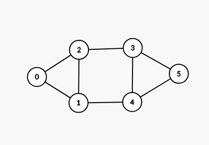

# Dzielenie grafu

Ten program jest drugą częścią projektu na jimp2, ma na celu dzielić graf na k klastrów, każdy klaster ma mieć rozmiar +/- n% w stosunku do innych klastrów. Używa on program stworzony przez inną grupę, który transkrybuje plik .csrrg na plik zawierający macierz pozycji oraz krawędzie grafu.

#### Spis treści
1. [Opis działania]()
2. [Dokumentacja implementacyjna]()
3. [Dokumentacja algorytmiczna]()
## Opis działania
Czyli jak używać programu.

Do kompilacji programu będzie potrzebne `gcc` oraz `make`

### Pobranie i uruchomienie

1. Sklonuj projekt na swój komputer używając `git`
```bash
git clone https://github.com/julian428/JIMP-Projekt-2025-cz2
```

2. Wejdź do folderu projektu
```bash
cd JIMP-Projekt-2025-cz2
```

3. Skompiluj projekt drugiej grupy
```bash
make sub
```

4. Skompiluj ten projekt
```bash
make
```
5. Uruchom program
```bash
./bin/divide_graph
```

### Szczegóły wywoływania programu.

Program może przyjąć do 4 parametrów.

1. Plik wejściowy `-i` ( czyli plik w formacie csrrg )
2. Plik wyjściowy `-o` ( czyli plik w którym zapisane będą klastry )
3. Ilość klastrów `-c` ( czyli na ile klastrów ma być podzielony graf )
4. Procent marginesu `-p` ( czyli procent maksymalnej różnicy pomiędzy rozmiarem klastrów )

#### Na przykład

```bash
./bin/divide_graph -i graf.csrrg -o regiony.txt -c 4 -p 20
```

Parametry mogą być ustawione w dowolnej kolejności. Nie koniecznie tak jak w powyższym przykładzie.

**UWAGA** Wartość odpowiadająca parametrowi musi znajdywać się zaraz po deklaracji parametru np. `-o test.txt`

Nie może dojść do takiej sytuacji:
```bash
./bin/divide_graph -o -i klastry.txt graf.csrrg
```

W powyższym przypadku program odczyta nazwe pliku wyjściowego jako `-i` a nazwe pliku wejściowego jako `klastry.txt`

### Przykładowe pliki wejścia i wyjścia

Wejście
```graf.csrrg
4
1;0;2;0;2;1
0;1;3;5;6
0;1;2;1;2;4;2;3;3;4;5;4;5
0;3;6;8;11
```

Wyjście
```clusters.txt
0 1 2
3 4 5
```

**W pliku wyjściowym każda linijka to oddzielny klaster.**

#### Wygląd grafu z podanych przykładów powyżej.



## Dokumentacja implementacyjna

1. Najpierw program parsuje podane argumenty i nadpisuje nimi jeżeli zostały podane domyślne parametry.
```c
char* new_output_file = getParameter(argc, argv, "-o");
char* new_input_file = getParameter(argc, argv, "-i");
char* new_cluster_count = getParameter(argc, argv, "-c");
char* new_percentage = getParameter(argc, argv, "-p");

if(new_output_file) output_file = new_output_file;
if(new_input_file) input_file = new_input_file;
if(new_cluster_count) cluster_count = atoi(new_cluster_count);
if(new_percentage) percentage = atof(new_percentage);
```

Funkcja `getParameter` iteruje przez podane argumenty i po znalezieniu napisu podanego jako trzeci arghument zwraca wartość argumentu znajdującego się po nim.

```c
if(!strcmp(params[i], param_prefix)) return params[i+1];
```

2. Następnie tworzony jest przetłumaczony plik z macierzą pozycji oraz krawędziami grafu.
```c
int res = createGraphFile(input_file, "output.txt");
if(res != 0) return 1;
```