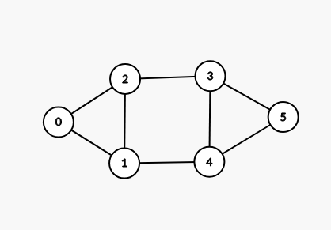
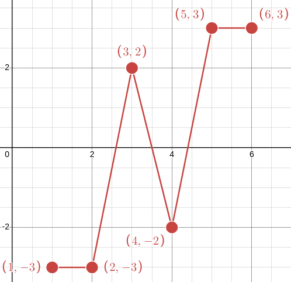
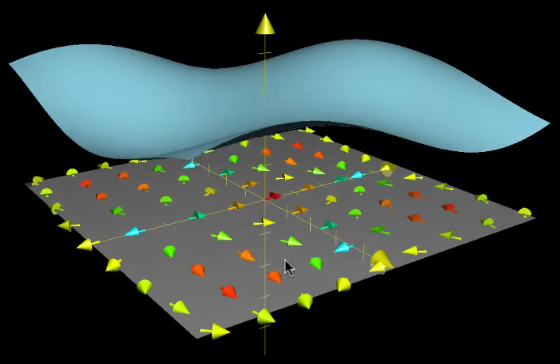
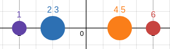
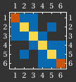
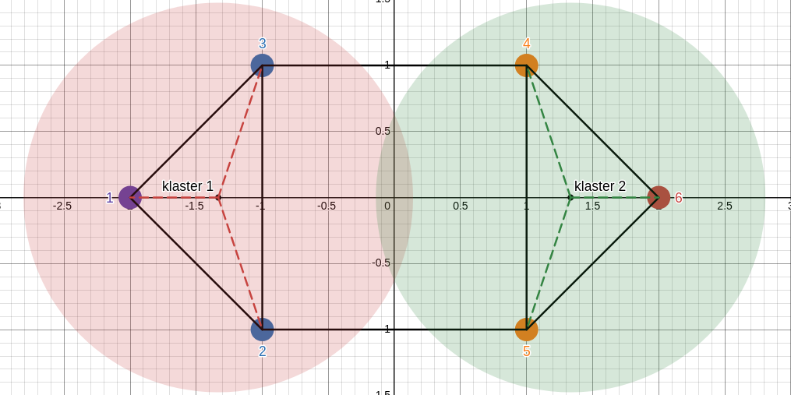
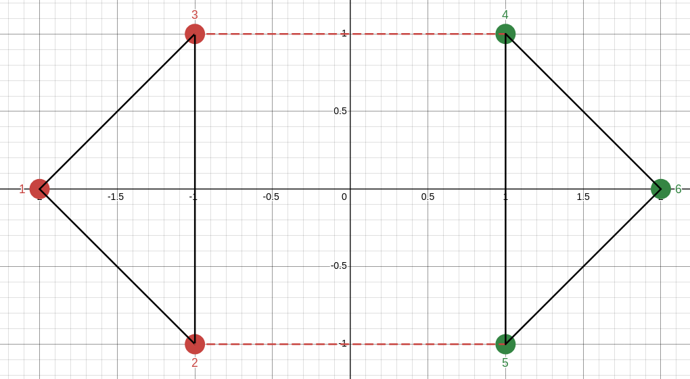

---
aliases:
---

# Czym jest spectral clustering?
Spectral clustering to algorytm dzielenia danych (np. wierzchołków grafu) na grupy (klastry) za pomocą analizy spektralnej macierzy.

- Działa na podstawie struktury grafu.
- Używa **macierzy Laplace’a** i jej **wektorów własnych**, aby znaleźć naturalne podziały. 

Wszystkie przykłady będą pokazywane na podstawie tego grafu:

---

# Dlaczego spectral clustering działa?

Spectral clustering używa macierzy Laplace'a aby pokazać różnicę pomiędzy sąsiadującymi wierzchołkami. Jest to bardzo podobne do działania operatora Laplace'a.

Wartość połączeń z sąsiadami w macierzy Laplace'a dla każdego wierzchołka:

---

Tutaj widzimy że najlepiej jest podzielić graf pomiędzy wierzchołkami 3 i 4 czyli wierzchołki ( 1, 2, 3 ) to klaster 1 a ( 4, 5, 6 ) to klaster 2.

Policzone ze wzoru: $Lx$ 
Gdzie $L$ to macierz Laplace'a a $x$ to wektor z wierzchołkami np.:

$$
x=\begin{pmatrix} 1 \\ 2 \\ 3 \\ 4 \\ 5 \\ 6 \end{pmatrix}
$$
---
### Operator Laplace'a na funkcji ciągłej:

---

## Podobieństwa
Macierz Laplace'a i jej wektory własne są bardzo podobne do tego jak przy całkowaniu możemy przejść z współrzędnych kartezjańskich na biegunowe. Po przejściu na spektrum macierzy ( przestrzeń wektorów własnych ) łatwiej jest nam podzielić graf na klastry ponieważ wierzchołki dobrze połączone są blisko siebie w przestrzeni wektorowej.

---

dla najmniejszego nie zerowego wektora [( Fiedlera )](https://en.wikipedia.org/wiki/Algebraic_connectivity):
 

$$
\lambda_1=\begin{pmatrix}
-2 \\ -1 \\ -1 \\ 1 \\ 1 \\ 2
\end{pmatrix}
$$

 

Przedstawienie wierzchołków grafu w przestrzeni wektora własnego:

---

# Działanie krok po kroku
## 1. macierz sąsiedztwa
Macierz sąsiedztwa do podanego grafu wygląda tak:
 
$$
A = \begin{pmatrix}
0 & 1 & 1 & 0 & 0 & 0 \\
1 & 0 & 1 & 0 & 1 & 0 \\
1 & 1 & 0 & 1 & 0 & 0 \\
0 & 0 & 1 & 0 & 1 & 1 \\
0 & 1 & 0 & 1 & 0 & 1 \\
0 & 0 & 0 & 1 & 1 & 0 \\
\end{pmatrix}
$$

Macierz sąsiedztwa musi być symetryczna ponieważ w innym przypdaku wektory własne macierzy Laplace'a nie były by orthagonalne.

---
## 2. Macierz Laplace'a

Macierz Laplace'a jest liczona następującym wzorem:
$$
L = D - A
$$
gdzie $D$ jest macierzą diagonalną [( Macierz stopniowa )](https://en.wikipedia.org/wiki/Degree_matrix):
$$
D_{ii}=\sum_{j=0}^{i-1} A_{ij} +\sum_{j=i+1}^{n}A_{ij}
$$
---
**Dla naszego przykładu $D$ ma wartość:**
$$
D = \begin{pmatrix}
2 & 0 & 0 & 0 & 0 & 0 \\
0 & 3 & 0 & 0 & 0 & 0 \\
0 & 0 & 3 & 0 & 0 & 0 \\
0 & 0 & 0 & 3 & 0 & 0 \\
0 & 0 & 0 & 0 & 3 & 0 \\
0 & 0 & 0 & 0 & 0 & 2 \\
\end{pmatrix}
$$

---
**Czyli $L$ jest równe:**

$$
L = \begin{pmatrix}
\textcolor{orange}{2} & \textcolor{blue}{-1} & \textcolor{blue}{-1} & 0 & 0 & 0 \\
\textcolor{blue}{-1} & \textcolor{yellow}{3} & \textcolor{blue}{-1} & 0 & \textcolor{blue}{-1} & 0 \\
\textcolor{blue}{-1} & \textcolor{blue}{-1} & \textcolor{yellow}3 & \textcolor{blue}{-1} & 0 & 0 \\
0 & 0 & \textcolor{blue}{-1} & \textcolor{yellow}3 & \textcolor{blue}{-1} & \textcolor{blue}{-1} \\
0 & \textcolor{blue}{-1} & 0 & \textcolor{blue}{-1} & \textcolor{yellow}3 & \textcolor{blue}{-1} \\
0 & 0 & 0 & \textcolor{blue}{-1} & \textcolor{blue}{-1} & \textcolor{orange}2 \\
\end{pmatrix}
$$
Tutaj znowu od razu widać jak najlepiej podzielić graf na dwie części.

---
## 3. Liczenie wektora własnego
Do policzenia wektora własnego używamy metody **Inverse Power Iteration**, następnie do każdego wierzchołka przypisujemy jego odpowiadającą wartość w wektorze własnym.

Po przejściu na spektrum macierzy:

---
### Jak liczymy wektory własne

Kilka słów o metodzie shiftedInversePowerMethod i wizualizacja
Kilka słów o metodzie gausa siedla i wizualizacja + wzór

---
## 4. Dzielenie grafu

Do dzielenia grafu używam algorytmu k-means który znajduje iteracyjnie idealny środek klastra i przypisując do niego najbliższe wierzchołki.

---
## 5. Wynik końcowy

Podzielony graf na dwa klastry:

---
## Źródła

- [Spectral Clustering (wikipedia)](https://en.wikipedia.org/wiki/Spectral_clustering)
- [Macierz Laplace'a (wikipedia)](https://en.wikipedia.org/wiki/Laplacian_matrix)
- [Spektrum Macierzy (wikipedia)](https://en.wikipedia.org/wiki/Spectrum_of_a_matrix)
- [Operator Laplace'a (youtube)](https://www.youtube.com/watch?v=EW08rD-GFh0)
- [Shifted Inverse Power Iteration Method (youtube)](https://www.youtube.com/watch?v=Cd2Nty4V-dk)