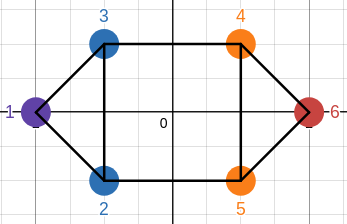

---
aliases:
---

# Czym jest spectral clustering?
Spectral clustering to algorytm dzielenia danych (np. wierzchołków grafu) na grupy (klastry) za pomocą analizy spektralnej macierzy.

- Działa na podstawie struktury grafu.
- Używa **macierzy Laplace’a** i jej **wektorów własnych**, aby znaleźć naturalne podziały. 

Wszystkie przykłady będą pokazywane na podstawie tego grafu:

---

# Dlaczego spectral clustering działa?

Spectral clustering używa macierzy Laplace'a aby pokazać różnicę pomiędzy sąsiadującymi wierzchołkami. Jest to bardzo podobne do działania operatora Laplace'a.

Wartość połączeń z sąsiadami w macierzy Laplace'a dla każdego wierzchołka:

---

Tutaj widzimy że najlepiej jest podzielić graf pomiędzy wierzchołkami 3 i 4 czyli wierzchołki ( 1, 2, 3 ) to klaster 1 a ( 4, 5, 6 ) to klaster 2.

Policzone ze wzoru: $Lx$ 
Gdzie $L$ to macierz Laplace'a a $x$ to wektor z wierzchołkami np.:

$$
x=\begin{pmatrix} 1 \\ 2 \\ 3 \\ 4 \\ 5 \\ 6 \end{pmatrix}
$$
---
### Operator Laplace'a na funkcji ciągłej:

---

## Po co nam wektory własne?
Macierz Laplace'a i jej wektory własne są bardzo podobne do tego jak przy całkowaniu możemy przejść z współrzędnych kartezjańskich na biegunowe. Po przejściu na spektrum macierzy ( przestrzeń wektorów własnych ) łatwiej jest nam podzielić graf na klastry ponieważ wierzchołki dobrze połączone są blisko siebie w przestrzeni wektorowej.

---

dla najmniejszego nie zerowego wektora [( Fiedlera )](https://en.wikipedia.org/wiki/Algebraic_connectivity):
 

$$
\lambda_1=\begin{pmatrix}
-2 \\ -1 \\ -1 \\ 1 \\ 1 \\ 2
\end{pmatrix}
$$

 

Przedstawienie wierzchołków grafu w przestrzeni wektora własnego:

---

# Działanie krok po kroku
## 1. macierz sąsiedztwa
Macierz sąsiedztwa do podanego grafu wygląda tak:
 
$$
A = \begin{pmatrix}
0 & 1 & 1 & 0 & 0 & 0 \\
1 & 0 & 1 & 0 & 1 & 0 \\
1 & 1 & 0 & 1 & 0 & 0 \\
0 & 0 & 1 & 0 & 1 & 1 \\
0 & 1 & 0 & 1 & 0 & 1 \\
0 & 0 & 0 & 1 & 1 & 0 \\
\end{pmatrix}
$$

W macierzy symetrycznej wszystkie wektory własne są do siebie prostopadłe.

---
## 2. Macierz Laplace'a

Macierz Laplace'a jest liczona następującym wzorem:
$$
L = D - A
$$
gdzie $D$ jest macierzą diagonalną [( Macierz stopniowa )](https://en.wikipedia.org/wiki/Degree_matrix):
$$
D_{ii}=\sum_{j=0}^{i-1} A_{ij} +\sum_{j=i+1}^{n}A_{ij}
$$
---
**Dla naszego przykładu $D$ ma wartość:**
$$
D = \begin{pmatrix}
2 & 0 & 0 & 0 & 0 & 0 \\
0 & 3 & 0 & 0 & 0 & 0 \\
0 & 0 & 3 & 0 & 0 & 0 \\
0 & 0 & 0 & 3 & 0 & 0 \\
0 & 0 & 0 & 0 & 3 & 0 \\
0 & 0 & 0 & 0 & 0 & 2 \\
\end{pmatrix}
$$

---
**Czyli $L$ jest równe:**

$$
L = \begin{pmatrix}
\textcolor{orange}{2} & \textcolor{blue}{-1} & \textcolor{blue}{-1} & 0 & 0 & 0 \\
\textcolor{blue}{-1} & \textcolor{yellow}{3} & \textcolor{blue}{-1} & 0 & \textcolor{blue}{-1} & 0 \\
\textcolor{blue}{-1} & \textcolor{blue}{-1} & \textcolor{yellow}3 & \textcolor{blue}{-1} & 0 & 0 \\
0 & 0 & \textcolor{blue}{-1} & \textcolor{yellow}3 & \textcolor{blue}{-1} & \textcolor{blue}{-1} \\
0 & \textcolor{blue}{-1} & 0 & \textcolor{blue}{-1} & \textcolor{yellow}3 & \textcolor{blue}{-1} \\
0 & 0 & 0 & \textcolor{blue}{-1} & \textcolor{blue}{-1} & \textcolor{orange}2 \\
\end{pmatrix}
$$
Tutaj znowu od razu widać jak najlepiej podzielić graf na dwie części.

---
## 3. Liczenie wektora własnego
Do policzenia wektora własnego używamy metody **shifted Inverse Power Iteration**, następnie do każdego wierzchołka przypisujemy jego odpowiadającą wartość w wektorze własnym.

Po przejściu na spektrum macierzy:

---
### Jak działa *Shifted Inverse Power Iteration*

Ta metoda polega na znalezieniu wektora własnego, który jest najbliżej podanej wartości.
Używająć wzoru $(A-\sigma I)x_{n+1}=x_n$. Ten wzór został wyprowadzony z wzoru $(A-\sigma I)^{-1}v = \frac{1}{\lambda - \sigma}v$. Gdzie widzimy że wartość najbliższa $\sigma$ jest teraz najbardziej znacząca.

---
### Przykład
Dla macierzy $A = \begin{pmatrix} 2 & 1 \\ 1 & 3 \end{pmatrix}$ oraz $\sigma = 3.5$:
 

1. **Macierz przesunięta ( *shifted* )**
   $$
   A-\sigma I = \begin{bmatrix} 2-3.5 & 1 \\ 1 & 3 - 3.5 \end{bmatrix} = 
   \begin{bmatrix} -1.5 & 1 \\ 1 & -0.5 \end{bmatrix}
   $$
    
2. **Wybieramy początkowy wektor**
   $$
   x_0 = \begin{pmatrix} 1 \\ 0 \end{pmatrix}
   $$
   
---
3. **Podstawiamy wszystko do wzoru**
   
   $$
   \begin{bmatrix} -1.5 & 1 \\ 1 & -0.5 \end{bmatrix}x_1=\begin{bmatrix} 1 \\ 0 \end{bmatrix}
   $$
    
   
   $$
   \begin{cases}
   -1.5x_{1a} + x_{1b} = 1 \\
   x_{1a}-0.5x_{1b}=0
   \end{cases}
   $$
   Z tego możemy policzyć:
   $$
   x_1=\begin{pmatrix} 2 \\ 4 \end{pmatrix}
   $$

---
4. **Następnie normalizujemy i powtarzamy poprzednie kroki aż $x_n \approx x_{n+1}$**
   $$
   ||x_{1}||=\sqrt{2^2+4^2}=2\sqrt{5}
   $$
   $$
   x_1=\frac{1}{2\sqrt{5}}\begin{bmatrix} 2 \\ 4 \end{bmatrix}=\begin{bmatrix} \frac{1}{\sqrt{5}} \\ \frac{2}{\sqrt{5}} \end{bmatrix}
   $$
  
 ---
   
5. **Po spełnieniu wymagań aproksymacji wektora dostajemy**
   W tym przypdaku zakończyłem proces do aproksymacji do 3 miejsc po przecinku

   $$
   x \approx \begin{pmatrix} 0.526 \\ 0.851 \end{pmatrix}
   $$
6. **Ostatnim krokiem jest przypisanie każdej wartości z wektora do każdego wierzchołka**
   Czyli pierwszy wierzchołek dostaje pierwszą wartość wektora własnego itd.
   
---
## 4. Dzielenie grafu

Do dzielenia grafu używam algorytmu k-means który znajduje iteracyjnie idealny środek klastra i przypisując do niego najbliższe wierzchołki.

---
## 5. Wynik końcowy

Podzielony graf na dwa klastry:

---
## Źródła

- [Spectral Clustering (wikipedia)](https://en.wikipedia.org/wiki/Spectral_clustering)
- [Macierz Laplace'a (wikipedia)](https://en.wikipedia.org/wiki/Laplacian_matrix)
- [Spektrum Macierzy (wikipedia)](https://en.wikipedia.org/wiki/Spectrum_of_a_matrix)
- [Operator Laplace'a (youtube)](https://www.youtube.com/watch?v=EW08rD-GFh0)
- [Spectral clustering (youtub)](https://youtu.be/uxsDKhZHDcc?si=33hIhrfPiwN_16aT)
- [Shifted Inverse Power Iteration Method (youtube)](https://www.youtube.com/watch?v=Cd2Nty4V-dk)